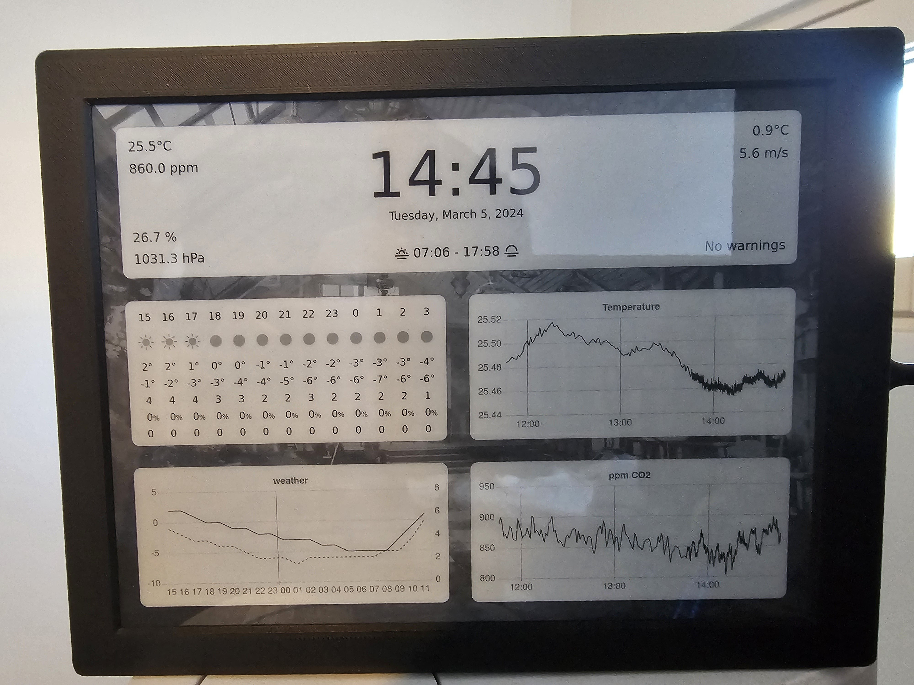

# Eink Project

This project is in its very initial stage of development and the codebase may not be fully functional or well-organized at this point.
Images:

<p align="middle">
    
    
</p>

### Installation

Install system dependencies

```
libcairo2-dev libpango1.0-dev libjpeg-dev libgif-dev librsvg2-dev
```

### Running the project

```
yarn dev
```

### Configuration

#### List of environment variables

| Environment variable | Description                                                         |
| -------------------- | ------------------------------------------------------------------- |
| `DEV = true`         | The program uses fake sensor data and uses old cached weather data. |
| `WEBIMAGES = true`   | The program shows all of the views on the website                   |
| `DISPLAY_VOLTAGE`    | Eink panel voltage. For dev just put -1.                            |
